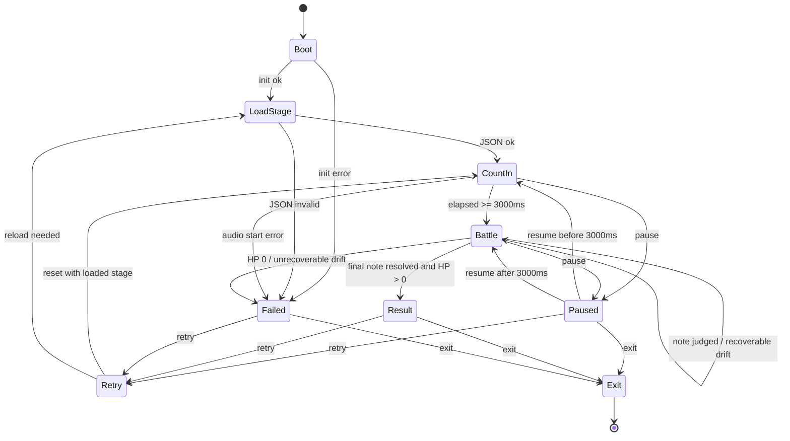

# Stage 1 Portable Runner State Machine

This state machine is for the Unity Stage 1 vertical slice using `docs/exports/switch-stage1-shotengai.stage.json`. It covers local gameplay flow, pause/resume, failure, retry, and timing recovery. It does not include production deployment or platform-specific integration.

## States

| State | Purpose |
| --- | --- |
| `Boot` | Create services and prepare local runtime dependencies. |
| `LoadStage` | Load JSON, choose difficulty, build chart/runtime state. |
| `CountIn` | Start audio clock and wait through the 3.0 second count-in. |
| `Battle` | Advance chart, process input, judge notes, update HP/combo/result state. |
| `Paused` | Freeze input consumption and audio-clock progression while preserving pending notes. |
| `Result` | Show completed-chart result when HP remains above 0. |
| `Failed` | Show failure result when HP reaches 0 or a nonrecoverable runtime error occurs. |
| `Retry` | Reset Stage 1 run state and re-enter `LoadStage` or `CountIn`. |
| `Exit` | Leave the Stage 1 slice. |

## Transition Table

| From | Trigger | Guard | To | Required actions |
| --- | --- | --- | --- | --- |
| `Boot` | Runtime initialized | Local services ready | `LoadStage` | Initialize `AudioClock`, `InputAdapter`, `StageJsonLoader`. |
| `Boot` | Runtime init error | Cannot continue | `Failed` | Store error in debug snapshot. |
| `LoadStage` | JSON loaded | Stage id is `shotengai`; difficulty is Easy/Normal/Hard | `CountIn` | Load chart, reset HP to 12, combo to 0, note index to 0. |
| `LoadStage` | JSON missing/invalid | Cannot build StageData | `Failed` | Report load failure; do not start audio. |
| `CountIn` | Start accepted | Audio start scheduled | `CountIn` | Set `songStartDspTime`, play BGM, show countdown. |
| `CountIn` | `elapsedMs >= 3000` | HP > 0 | `Battle` | Start judging against battle clock `elapsedMs - 3000`. |
| `CountIn` | Pause input | Audio can pause | `Paused` | Pause BGM and clock; preserve count-in remaining time. |
| `CountIn` | Audio start failed | Cannot recover locally | `Failed` | Save snapshot with audio error. |
| `Battle` | Note judged non-Miss | Any note type | `Battle` | Increment combo, update maxCombo, update judge stats. |
| `Battle` | Tap/Hold Miss | HP after damage > 0 | `Battle` | Reset combo; subtract `enemy.attackPower * enemyAttackMultiplier`. |
| `Battle` | Tap/Hold Miss | HP after damage <= 0 | `Failed` | Stop judging, save result snapshot with `clear=false`. |
| `Battle` | Mash Miss | HP unchanged | `Battle` | Reset combo; increment mash miss; do not subtract HP in portable runner parity. |
| `Battle` | Final note resolved | HP > 0 | `Result` | Calculate score/rank/maxCombo/judge breakdown/clear. |
| `Battle` | Pause input | Audio can pause | `Paused` | Pause BGM, stop consuming input events, preserve pending note state. |
| `Battle` | Hold release missed | Hold has start but no valid release before deadline | `Battle` or `Failed` | Resolve Hold as Miss; apply tap/hold miss damage. |
| `Battle` | Hold interrupted by pause | Current note is hold and button state is down | `Paused` | Preserve hold start time and held button state. Do not auto-release. |
| `Battle` | Audio drift detected | Drift exceeds tolerance | `Battle` | Resync `AudioClock` to audio playback time; keep note state unchanged. |
| `Battle` | Audio drift unrecoverable | Playback stopped or timestamp invalid | `Failed` | Stop run and save diagnostic snapshot. |
| `Paused` | Resume input | Audio resumes successfully | `CountIn` | If `elapsedMs < 3000`, continue count-in from preserved time. |
| `Paused` | Resume input | Audio resumes successfully | `Battle` | If `elapsedMs >= 3000`, continue battle from preserved battle clock. |
| `Paused` | Resume while hold is down | Held input still down | `Battle` | Keep original hold `downAtMs`; wait for actual release event. |
| `Paused` | Resume after hold button was released while paused | Held input no longer down | `Battle` | Resolve the hold at resume time or mark interrupted Miss, using one consistent policy in tests. |
| `Paused` | Retry selected | Any paused point | `Retry` | Stop audio, discard pending inputs, keep selected difficulty. |
| `Paused` | Exit selected | Any paused point | `Exit` | Stop audio and leave Stage 1 slice. |
| `Result` | Retry selected | Result visible | `Retry` | Reset runtime state. |
| `Result` | Exit selected | Result visible | `Exit` | Persist optional local result snapshot, stop audio. |
| `Failed` | Retry selected | Failure visible | `Retry` | Reset runtime state. |
| `Failed` | Exit selected | Failure visible | `Exit` | Persist optional failure snapshot, stop audio. |
| `Retry` | Reset complete | Stage data still valid | `CountIn` | Reuse loaded JSON, reset HP/combo/stats/input buffers, restart audio clock. |
| `Retry` | Stage data invalidated | Need reload | `LoadStage` | Reload JSON and rebuild chart. |

## Required Runtime Invariants

- `Boot` and `LoadStage` do not judge input.
- `CountIn` accepts pause/exit/control input, but rhythm notes are not judged until battle clock starts.
- `Battle` is the only state that resolves tap/hold/mash notes.
- `Paused` must not advance `elapsedMs`, `battleClockMs`, pending note deadlines, or mash windows.
- `Result` and `Failed` are terminal for the current run; only `Retry` or `Exit` may leave them.
- `Retry` always resets HP, combo, maxCombo, judge counts, note index, hold state, mash buffers, and input queue.
- `Exit` performs no external submission.

## HP 0

HP starts at `12`.

Portable runner parity:

- Tap Miss: subtract `1`.
- Hold Miss: subtract `1`.
- Mash Miss: HP unchanged.
- If HP reaches `0`, transition from `Battle` to `Failed` immediately.
- Score may still be calculated for diagnostics, but `clear=false`.

## Chart Completion

The chart is complete when:

1. The final note has been resolved.
2. No pending hold or mash note remains open.
3. HP is greater than `0`.

Then transition `Battle -> Result` and calculate:

- `score`
- `rank`
- `maxCombo`
- `perfect/good/bad/miss`
- `remainingHp`
- `clear=true`

## Pause And Resume

Pause can occur in `CountIn` or `Battle`.

On pause:

- Pause BGM.
- Freeze `AudioClock`.
- Stop consuming rhythm input events.
- Preserve currently held inputs and pending note state.
- Do not auto-miss notes while paused.

On resume:

- Resume BGM.
- Add paused duration to the clock offset.
- Continue from `CountIn` if count-in was not complete.
- Continue from `Battle` if count-in was complete.
- If a hold was active before pause, keep its original `downAtMs`.

Hold interruption policy for first slice:

- If the player releases during pause and the runtime cannot timestamp that release, resolve the hold as Miss on resume.
- If release is captured by the input system with a valid timestamp, use that timestamp and judge normally.
- Whichever policy is implemented must be covered by a deterministic test.

## Audio Drift

Use an audio-backed monotonic clock as the master. Drift is the difference between expected elapsed time and actual audio playback position.

Recommended first-slice policy:

- If drift is within tolerance, do nothing.
- If drift exceeds tolerance but audio playback is valid, resync `AudioClock` to playback time.
- If audio playback is stopped, invalid, or cannot be queried, transition to `Failed`.

Judgement must use the corrected audio clock after resync. Do not shift note data.

## Mermaid Overview

